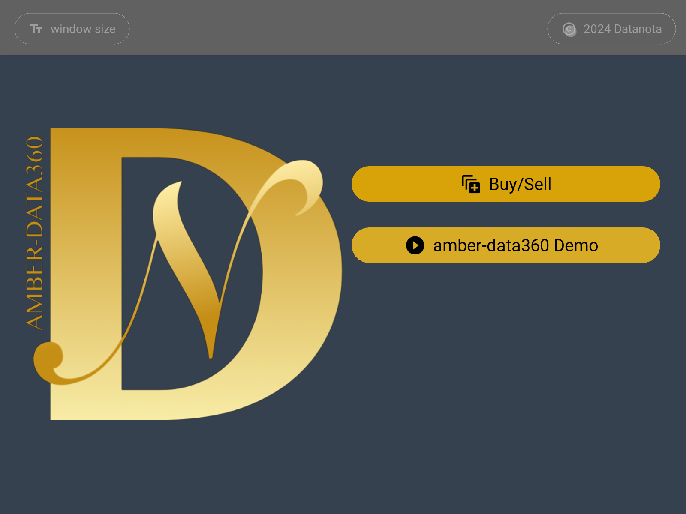
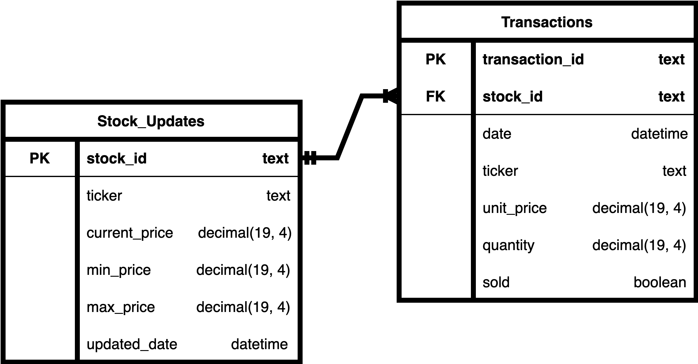
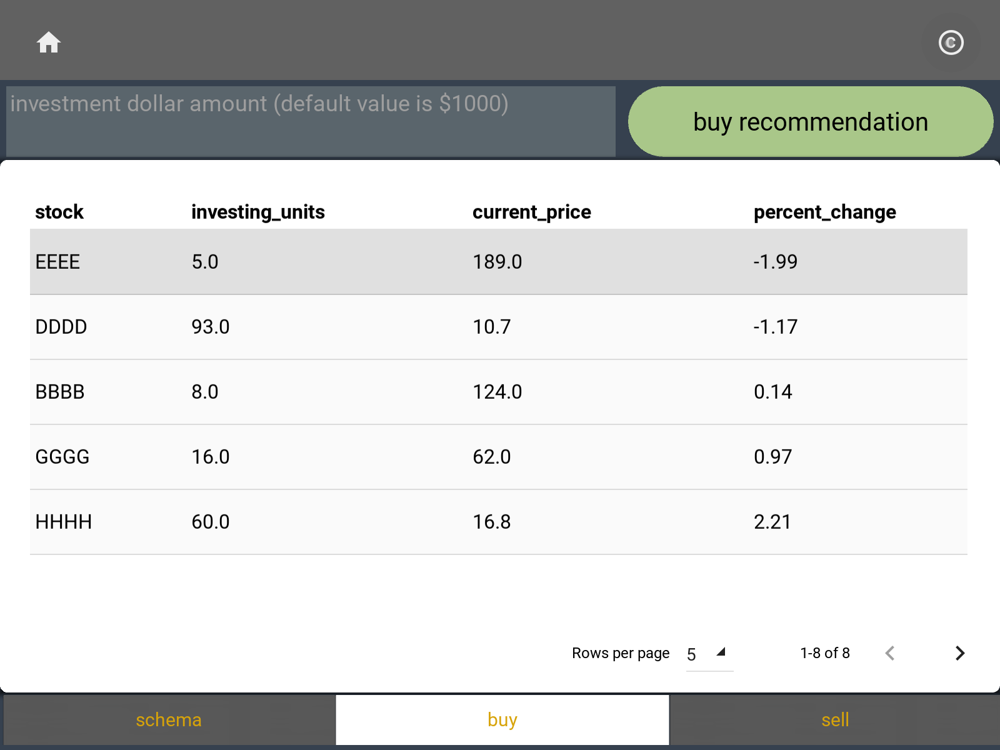
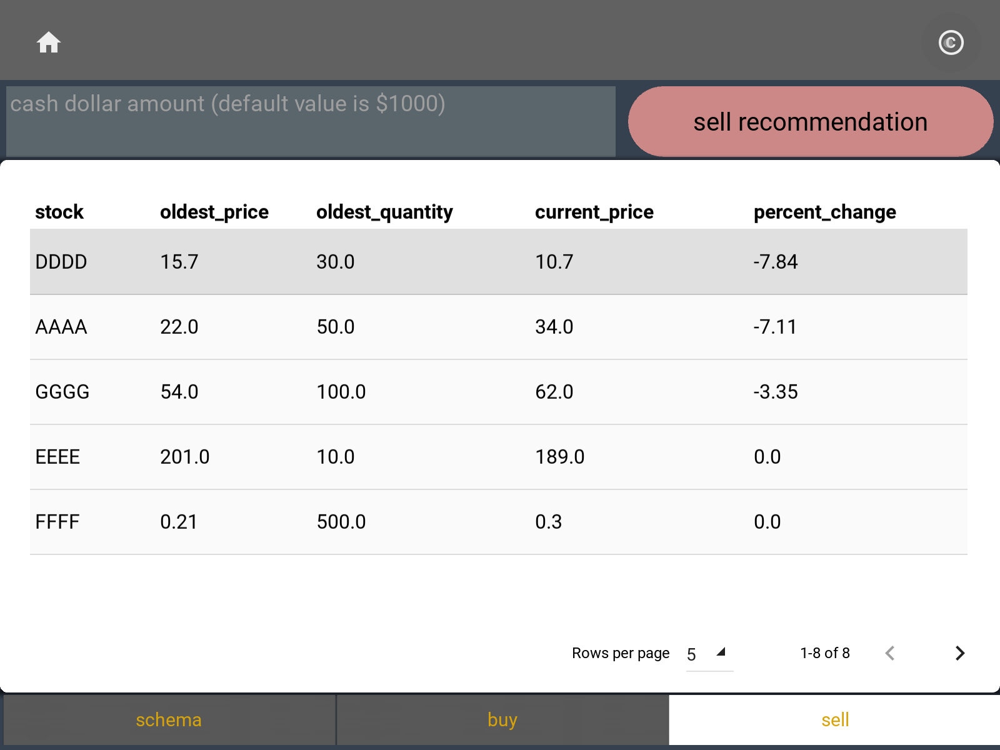

# Datanota AMBER - DATA360
## stock investment recommendation

Version: MVP 

algorithm: simple weighted average

 

 

## database:
        an Excel file is the data source

 

 

## buy: 
        given a dollar amount (default value is $1000)
            1. to calculate quantity per stock (considering current price)
            2. to calculate percentage change in weighted average price if invested
            3. to sort from smallest to largest

 

 

## sell: 
        given a dollar amount (default value is $1000)
            1. find the oldest transaction
            2. list the oldest unit_price and quantity
            3. calculate percentage change in weighted average after selling the oldest entry

 

